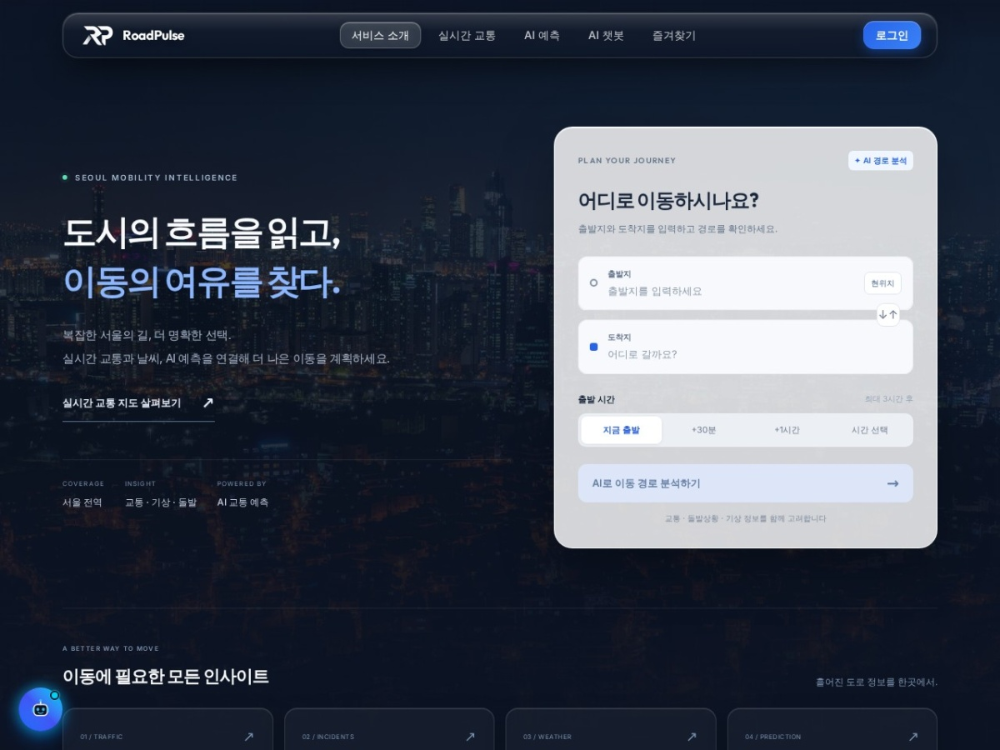

# 🚦 RoadPulse (Seoul AI Traffic)
> **AI 기반 서울시 교통량 예측 및 최적 경로 추천 서비스**

[](https://roadpulse-a2sz.onrender.com)
*(이미지를 클릭하면 웹사이트로 이동합니다)*

## 📖 1. 프로젝트 소개
**RoadPulse**는 서울시의 주요 도로 교통량을 AI 모델을 통해 예측하고, 단순한 최단 거리가 아닌 **'실제 교통 상황을 반영한 최적의 경로'**를 추천해주는 웹 서비스입니다. 
경로가 추천된 이유를 LLM(거대 언어 모델) 기반의 챗봇 기능을 통해 자연스러운 문장으로 설명하여, 사용자가 왜 해당 경로가 가장 빠른지 쉽고 직관적으로 이해할 수 있도록 돕습니다.

## 🛠 2. 사용 기술 (Tech Stack)

| Category | Technologies |
| :--- | :--- |
| **Languages** |   |
| **Frontend** |    |
| **Backend** |   |
| **Database & Cloud** |     |
| **AI & Data** |     |
| **Tools** |    |

## 🧑‍🤝‍🧑 3. 팀원 및 역할 분담 (Team & Roles)

| 이름 | 담당 및 역할 (Role) | 주요 기여 내용 |
| :--- | :--- | :--- |
| **김경민**<br>([@kimgyeongmin5348](https://github.com/kimgyeongmin5348)) | **Frontend / Backend / Infra** | - KMA(기상청)/TOPIS 실시간 수집 스케줄러 및 전체 외부 API 연동 개발<br>- AWS EC2, RDS 인프라 구축 및 전체 데이터베이스 설계/관리<br>- FastAPI 백엔드 서버 및 React 프론트엔드 UI/UX 전체 구현<br>- LLM 챗봇 프롬프트 엔지니어링 및 모델 연동 |
| **한인혁**<br>([@inBBong](https://github.com/inBBong)) | **Data & ML Engineering** | - OSRM 맵 매칭 및 경로 학습 데이터셋(OD 기반) 구축 파이프라인 개발<br>- XGBoost/LightGBM 기반 통행 소요 시간 및 교통량 예측 모델 학습<br>- ML 파이프라인 구축 및 머신러닝 모델 성능 튜닝 |

## 📂 4. 파일 구조 (Project Structure)
프로젝트는 크게 프론트엔드, 백엔드, 머신러닝 파이프라인, 데이터 수집 스크립트로 분리되어 관리됩니다.

```text
SEOUL_AI_TRAFFIC/
├── backend/            # FastAPI 백엔드 서버
│   ├── src/api/        # REST API 라우터 (경로 예측, 데이터 조회 등)
│   ├── src/db/         # 데이터베이스 스키마, 마이그레이션 및 ORM 모델
│   ├── src/services/   # ML/LLM 경로 예측 비즈니스 로직
│   └── src/workers/    # 실시간 데이터 수집 스케줄러 (APScheduler)
├── frontend/           # React 단일 페이지 애플리케이션 (Vite)
│   ├── src/pages/      # 대시보드, 경로 추천, 날씨, 챗봇 등 화면 컴포넌트
│   └── src/components/ # 공통 UI 및 지도(Kakao Map) / 차트 위젯
├── ml/                 # 머신러닝 모델 학습 파이프라인
│   ├── src/models/     # XGBoost, LightGBM 모델 학습 및 하이퍼파라미터 튜닝
│   └── artifacts/      # 학습이 완료된 최적 모델 파일(.joblib) 및 평가 리포트
├── scripts/            # 초기 데이터 구축 및 실시간 데이터 수집 수동 스크립트
├── data/               # 수집된 Raw 데이터 및 전처리된 학습 데이터셋 저장소
└── infra/              # 서버 인프라 및 배포 구성 파일
```

## 🏛 5. 기술 아키텍처 (System Architecture)

```
사용자 브라우저
    │  React SPA (Vite, Tailwind CSS, Kakao Maps API)
    │  → 출발지/도착지 입력, 경로 지도 시각화, LLM 챗봇 UI
    ↕ /api
FastAPI 서버 (Render 웹 컨테이너, Docker)
    │  ├─ /api/routes/predict  → OSRM 후보 경로 탐색 → ML 모델 랭킹
    │  ├─ /api/chat            → 챗봇 (NVIDIA NIM LLM 호출)
    │  └─ /api/data/*          → 대시보드용 실시간 DB 조회
    ↕
AWS RDS (MySQL)
    │  traffic_speed_measurements, traffic_volume_measurements,
    │  weather_measurements, incidents, route_request_logs ...
    ↑
roadpulse-worker 컨테이너 (APScheduler, Docker)
    │  5분  : 도로 실시간 속도 + 돌발 상황 (서울 TOPIS API)
    │  1시간: 교통량 + 기상 (기상청 ASOS API)
    └  1시간: 완료된 AI 예측값 ↔ 실제값 비교(온라인 평가)
```

**핵심 설계 포인트**
- **웹 서버 / 데이터 수집 워커 분리**: 같은 Docker 이미지를 `render.yaml`의 `web`과 `worker` 서비스로 분리 실행. API 서버 부하 없이 데이터를 꾸준히 적재하며, 로컬에서 두 프로세스를 함께 실행하면 중복 API 호출 및 DB 쓰기 경합이 발생하므로 주의.
- **온라인 평가 루프**: 모델이 예측한 교통량(`predicted_volume`)은 `traffic_predictions` 테이블에 저장. 1시간마다 목표 시각이 지난 행을 탐색해 실제 교통량(`actual_volume`)을 자동으로 채우고 MAE/RMSE를 축적 → 운영 중인 모델의 성능이 지속적으로 추적됨.
- **배포 자동화**: `main` 브랜치에 푸시하면 Render가 Docker 이미지를 자동 빌드 및 재배포. SQL 마이그레이션은 별도 스크립트(`apply_sql_migration`)로 사전 수동 적용.

---

## 🤖 6. AI 추론 방법 (AI Inference Method)

### 학습 목표 (Target)

OSRM이 제시한 경로를 실제로 주행했을 때의 **실제 소요 시간(초)** `actual_duration_sec`를 예측합니다.  
OSRM의 기본 소요 시간은 이상적인 도로 속도 기반이므로, 실제 교통 체증이 반영되지 않습니다. 모델은 이 **OSRM 추정값 대비 실측 괴리**를 학습합니다.

$$\hat{y} = f(\mathbf{x}) \approx \text{actual\\_duration\\_sec}$$

> $\mathbf{x}$: 출발 시점에 수집 가능한 35개 피처 벡터 (미래 데이터 누수 없음)

### 입력 피처 (35개)

| 카테고리 | 피처 | 설명 |
|:---|:---|:---|
| 경로 기본 | `route_distance_m`, `osrm_duration_sec`, `segment_count` | OSRM 제공 거리·시간·구간 수 |
| 링크 매칭 품질 | `link_match_ratio`, `direction_match_ratio`, `opposite_direction_ratio` | 경로가 실제 도로 링크 DB와 얼마나 일치하는지 |
| 실시간 속도 | `speed_lag_kmh`, `speed_lag_min_kmh`, `speed_lag_travel_time_sec`, `speed_lag_coverage`, `speed_lag_age_min` | 출발 직전 실측 링크 속도 및 데이터 신선도 |
| 교통량 | `volume_lag_vph_mean`, `volume_lag_vph_max`, `volume_lag_coverage`, `volume_lag_age_hours` | 경로 구간 평균·최대 시간당 통행량 |
| 돌발 상황 | `accident_count`, `construction_count`, `control_length_m`, `incident_severity_max`, `incident_impact_score`, `incident_clear_overlap_sec` | 경로 내 사고/공사/통제 건수 및 심각도 |
| 기상 | `weather_temperature_c`, `weather_rainfall_mm`, `weather_humidity_pct`, `weather_age_hours` | 기상청 ASOS 실측 기상 데이터 |
| 시간 | `departure_hour`, `weekday`, `is_weekend` | 출발 시각, 요일, 주말 여부 |

### Time-series Split (시계열 홀드아웃)

랜덤 분할 시 미래 데이터가 학습에 유입되는 **Data Leakage**가 발생합니다. 이를 방지하기 위해 시간 순 홀드아웃을 적용합니다:

$$\text{Train} = \{ (x_i, y_i) \mid t_i < t_{\text{cutoff}} \}, \quad \text{Test} = \{ (x_i, y_i) \mid t_i \geq t_{\text{cutoff}} \}$$

$$t_{\text{cutoff}} = \text{departure\_at}\!\left[\left\lfloor 0.70 \times N \right\rfloor\right] \quad (\text{앞 70\% 학습, 뒤 30\% 검증})$$

### 모델 및 하이퍼파라미터

**XGBoost** / **LightGBM** 두 모델을 동시에 학습하여 검증 RMSE가 낮은 모델을 자동 선택(Best-saved):

```python
# XGBoost — Optuna 튜닝 최적 파라미터
{
  "objective": "reg:squarederror", "tree_method": "hist",
  "n_estimators": 128,   "learning_rate": 0.0886,
  "max_depth": 10,       "subsample": 0.701,
  "colsample_bytree": 0.653
}

# LightGBM — Optuna 튜닝 최적 파라미터
{
  "objective": "regression",
  "n_estimators": 349,   "learning_rate": 0.0282,
  "num_leaves": 130,     "subsample": 0.861,
  "colsample_bytree": 0.604
}
```

XGBoost의 학습 목적함수 (Squared Error + 정규화):

$$\mathcal{L} = \sum_{i=1}^{n}(y_i - \hat{y}_i)^2 + \sum_{k} \Omega(f_k), \quad \Omega(f) = \gamma T + \frac{1}{2}\lambda \|w\|^2$$

> $T$: 트리 리프 노드 수, $w$: 리프 가중치, $\gamma / \lambda$: 정규화 계수

### 평가 지표 (Evaluation Metrics)

#### 회귀 성능 지표

$$\text{MAE} = \frac{1}{n}\sum_{i=1}^{n}|y_i - \hat{y}_i|$$

$$\text{RMSE} = \sqrt{\frac{1}{n}\sum_{i=1}^{n}(y_i - \hat{y}_i)^2}$$

$$R^2 = 1 - \frac{\displaystyle\sum_{i=1}^{n}(y_i - \hat{y}_i)^2}{\displaystyle\sum_{i=1}^{n}(y_i - \bar{y})^2}$$

#### 경로 랭킹 지표 (실서비스 품질 측정)

단순 회귀 수치가 아니라 **"올바른 경로를 1순위로 추천했는가"** 를 별도로 측정합니다.

**① Top-1 Accuracy** — 예측 1순위 경로가 실제 최단 경로인 비율:

$$\text{Top-1 Acc} = \frac{1}{|Q|} \sum_{q \in Q} \mathbf{1}\!\left[\underset{r \in C_q}{\arg\min}\,\hat{y}_r \;=\; \underset{r \in C_q}{\arg\min}\,y_r\right]$$

> $Q$: 전체 경로 요청 집합, $C_q$: 요청 $q$의 후보 경로 집합

**② Pairwise Ranking Accuracy** — 후보 경로 쌍의 실제 순서를 맞힌 비율:

$$\text{Pairwise Acc} = \frac{\displaystyle\sum_{q}\sum_{i < j} \mathbf{1}\!\left[(\hat{y}_i < \hat{y}_j) = (y_i < y_j)\right]}{\displaystyle\sum_{q}\sum_{i < j} \mathbf{1}\!\left[\hat{y}_i \neq \hat{y}_j \;\wedge\; y_i \neq y_j\right]}$$

**③ Mean Regret** — 추천 경로와 실제 최적 경로의 통행시간 차이 평균(초):

$$\text{Mean Regret} = \frac{1}{|Q|}\sum_{q \in Q}\max\!\left(0,\; y_{\hat{r}^*_q} - y_{r^*_q}\right)$$

> $\hat{r}^*_q$: 모델이 추천한 1순위 경로, $r^*_q$: 실제 최단 경로 — 추천이 틀려도 얼마나 손해를 보는지 측정

### 🏆 실측 성능 (Leaderboard 기준, 2026-09-18)

> 베이스라인: OSRM 이상적 소요시간 그대로 사용 (AI 예측 없음)

| 모델 | MAE (초) | RMSE (초) | R² | Top-1 Acc | Pairwise Acc | Mean Regret (초) |
|:---|---:|---:|---:|---:|---:|---:|
| **LightGBM (Tuned)** ✅ | **110.3** | **159.6** | **0.9805** | **89.0%** | **89.0%** | **13.7** |
| XGBoost (Tuned) | 116.4 | 165.6 | 0.9790 | 88.5% | 88.5% | 14.5 |
| 베이스라인 (OSRM) | 1680.8 | — | — | 54.7% | 54.7% | 182.2 |

- **Top-1 Accuracy**: 54.7% → **89.0%** (+34.3%p) — OSRM 대비 경로 추천 정확도 약 2배 향상
- **Mean Regret**: 182초 → **13.7초** — 잘못 추천되더라도 실제 최적 대비 평균 손해 14초 미만

### 서빙 및 경로 랭킹 흐름

```
① 사용자 요청 (출발지 / 도착지)
② OSRM에서 후보 경로 N개 탐색
③ 각 경로에 대해 DB에서 실시간 피처 조회
   (속도 / 교통량 / 돌발 / 기상)
④ lru_cache로 인메모리에 올라와 있는
   Best-saved 모델.predict() 호출
⑤ 예측된 소요 시간(초)으로 경로 재정렬
⑥ 최단 예상 소요 경로에 ai=True 마킹
⑦ 프론트엔드에 결과 반환 → 카카오 지도 시각화
```

### 속도 예측 (미래 3시간 시계열)

특정 도로 구간의 향후 3시간 속도 예측 시, **단기(모델 추론) + 장기(과거 30일 시간대별 평균 패턴)** 를 블렌딩합니다:

$$v_{\text{final}}(h) = v_{\text{model}} \cdot \bigl(1 - \alpha(h)\bigr) + v_{\text{pattern}} \cdot \alpha(h)$$

$$\alpha(h) = \min\!\left(1.0,\; h \times 0.33\right) \qquad (h: \text{예측 시간 후, 단위: 시간})$$

> $h=0$이면 모델 추론 100%, $h \geq 3$이면 과거 패턴 100% 반영 → 장기 예측의 불확실성을 과거 통계로 점진적 보완

---


## 💬 7. LLM 추론 방법 (LLM Inference Method)

### 사용 모델 & 서빙 방식
- **모델**: NVIDIA NIM을 통해 서빙되는 DeepSeek 계열 추론형(Reasoning) LLM
- **API**: OpenAI 호환 `chat/completions` 엔드포인트 사용 (`temperature: 0.2` for 경로 설명 / `0.5` for 챗봇)
- **보안**: NVIDIA API Key는 서버 환경 변수에만 저장, 클라이언트(브라우저)에 절대 노출 안 됨

### 두 가지 LLM 활용 시나리오

**① 경로 추천 설명 (`/api/routes/predict` 후처리)**

ML 모델이 산출한 수치 데이터를 그대로 사용자에게 노출하지 않고, LLM이 자연어 설명 3문장을 JSON 배열로 생성:

```
[ML 수치 데이터 → 프롬프트 컨텍스트 주입]
- 선택된 경로 / 비교 경로별: 예상 소요 시간(분), 교통 체증 페널티(분, %),
  매칭된 도로명, 돌발 상황 건수, 실시간 평균 속도
- 예측 모델 버전, RMSE, 예측 기준 시각

[LLM 출력 (엄격한 JSON 배열 형식)]
["이 경로가 OO분 빠른 첫 번째 이유 문장",
 "주요 경유 도로 상황 설명 두 번째 이유 문장",
 "시간대·교통 패턴 종합 세 번째 이유 문장"]
```

프롬프트 규칙으로 개발 내부 용어(`OSRM`, `페널티`, `피처` 등) 및 수치 점수의 직접 노출을 금지하여, 항상 사람이 읽기 좋은 표현으로 변환.

**② 교통 챗봇 (`/api/chat`)**

사용자 질문에 RoadPulse DB의 실시간 데이터를 Grounding하여 응답:

```
System Prompt = 챗봇 규칙 + RoadPulse 근거 데이터(JSON)
  └─ 근거 데이터: 실시간 도로 속도, 교통량 측정값, 돌발 상황 목록,
                  기상 관측값, AI 예측 시계열, 과거 강수 영향 분석 등

멀티턴 대화 지원: 이전 messages 배열을 그대로 전달하여
LLM이 대화 맥락을 유지한 채 다음 응답 생성
```

모델의 `reasoning_content` (내부 사고 과정)도 함께 수신하여 프론트엔드 개발자 도구에서 추론 과정 디버깅 가능.

---

<details>
<summary><b>🛠 로컬 실행 가이드 (Getting Started)</b></summary>
<div markdown="1">

### 프로젝트 클론 및 패키지 설치
```bash
git clone https://github.com/your-repo/seoul-ai-traffic.git
cd seoul-ai-traffic

# 백엔드 의존성 설치 (uv 권장)
uv sync

# 프론트엔드 의존성 설치
cd frontend
npm install
```

### 서버 실행
```powershell
# 백엔드 서버 및 DB 연동 실행 (포트 8000)
uv run python main.py

# 프론트엔드 서버 실행 (포트 5173)
cd frontend
npm run dev
```
웹 브라우저에서 `http://localhost:5173/dashboard` 에 접속하여 서비스를 확인할 수 있습니다.

</div>
</details>
